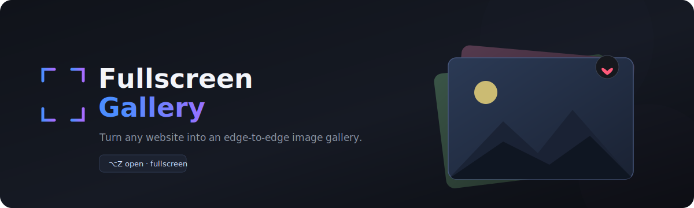
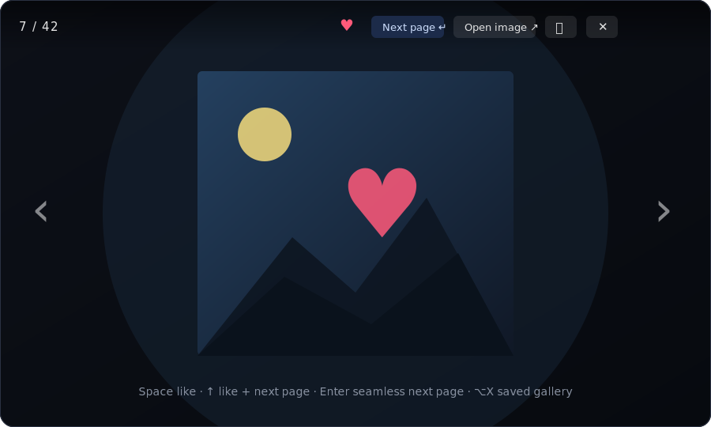

<p align="center">
  
</p>

<h1 align="center">Fullscreen Gallery</h1>

<p align="center">
  A Firefox extension that turns <b>any</b> website into an edge-to-edge image gallery —
  skips logos and icons, loads full-size images, jumps to the next page seamlessly,
  and lets you like &amp; save pictures locally.
</p>

<p align="center">
  
  
  
  
</p>

<p align="center">
  
</p>

---

## Why

Image-heavy pages bury photos in thumbnails, cards, grids, and lazy-loaders. This
extension pulls the *real* pictures out, drops you into true OS fullscreen, and gives
you keyboard-first navigation — including a seamless "next page" that fetches and
appends the linked page **without ever leaving the gallery**.

No accounts, no servers, no tracking, no dependencies. Everything runs locally and
likes are stored in your browser's own extension storage.

## Features

- **True fullscreen by default.** Opening via `⌥Z` happens inside a real keypress (the
  gesture browsers require), so it goes edge-to-edge immediately — no toolbar, no tabs,
  no preview strip. The whole screen is the image.
- **Fills the screen, no black bars.** Images are scaled up (aspect preserved) over a
  blurred, zoomed copy of themselves. Heavily-upscaled images get a gentle CSS
  blur + contrast/saturation bump that masks JPEG blocks and pixel edges — **no ML, no
  extra downloads**, stays lightweight.
- **Full-resolution images.** For each thumbnail it tries lightbox/shop data attributes,
  the enclosing `<a href>` when it points at an image, search-engine redirect unwrapping,
  and the largest `srcset` entry — falling back to the thumbnail only if nothing better loads.
- **Seamless next page.** `Enter` / `↑` fetches the next page in the background, extracts its
  images, appends them, and jumps to the first new one — the gallery never closes. It tries, in
  order, the image's own detail/card page, the page it was saved from, then the site's
  pagination (`rel="next"`, "Next/Older/More" links), and **only enters a page that has more
  than one gallery image** — so single-image dead-ends are skipped automatically and it keeps
  chaining deeper through a site.
- **Saved gallery is a browsing entrypoint.** `Enter` / `↑` works inside the favorites gallery
  too: from any saved image it dives back into that image's page (or the page you saved it from)
  to pull in more — so your bookmarks double as a jumping-off point to explore similar images.
  And **`O` / the "Open page ⤴" button navigates the current tab straight to that image's own
  page** — a real navigation — so a favorite becomes a one-key jump back to where the picture
  (and its gallery) actually lives.
- **Opens on what you're looking at.** The gallery starts on the image most visible in the
  current viewport; when several are similarly visible, it picks the one whose center is closest
  to your cursor.
- **Closes where you left off.** On close it scrolls the page so the last image you viewed is
  centered and fully in view — falling back to your original scroll position for off-page images
  (saved gallery items or next-page results that aren't on the current page).
- **No dead-end navigation.** If a card links straight to an image file (not a page), the
  gallery never navigates there — that image is already shown, so "next page" is simply
  suppressed for it.
- **Like &amp; save locally.** `Space` / `↑` saves the current image to local extension storage
  (persists across sessions, nothing downloaded to disk). `⌥X` opens those saved images as
  their own gallery; `⌥C` clears them. Liking again unlikes.
- **Auto-continues at the end — with real lazy-loading.** As you approach the end of the current
  set, the gallery quietly scrolls the underlying page to trigger lazy-loaders and appends what
  shows up. Once a page is fully harvested it **travels to the next gallery page for real** — a
  genuine same-tab navigation (same-origin) — so the browser renders that page and *its* lazy /
  infinite-scroll images actually load, instead of dead-ending on the handful present in static
  HTML. The gallery **auto-reopens on arrival and resumes on the image you left off**, so it feels
  continuous. (Manual `Enter` / `↑` still does the fast in-place seamless peek without reloading.)
- **Page-aware back & address bar.** Each time it advances into a new page, the tab's **address
  bar follows** (same-origin pages, via `history` — so closing the gallery leaves you on the page
  you browsed to). Press `↓` / `S` to **step back a page**, landing back on the exact image you
  left off on and restoring that page's URL.
- **Junk filtering.** Skips anything under ~140px per side, tiny-area banners, and anything whose
  class/id/alt/url matches `logo|icon|sprite|avatar|emoji|badge|favicon|spinner|button|…`.
  Optionally skips SVGs, `<nav>`/`<footer>` images, and same-origin transparent PNGs.
- **Robust UI.** The whole interface lives in a **Shadow DOM**, so the host page's CSS can't break it.

## Controls

| Key | Action |
|---|---|
| `⌥Z` | Open / close the gallery (opens **fullscreen by default**) |
| `⌥X` | Open the **saved gallery** of liked images |
| `⌥C` | Clear the saved gallery |
| `→` / `D` | Next image |
| `←` / `A` | Previous image |
| `↑` / `W` | Like + save **and** go to the next page if one exists |
| `↓` / `S` | Go **back a page** — return to the image you left on (else previous image) |
| `Space` | Toggle like / save |
| `Enter` | Seamlessly load the next page (no like) |
| `O` | Open this image's own page in the **same tab** (real navigation) |
| `F` | Toggle fullscreen |
| `Esc` | Close (first press exits fullscreen) |
| `Home` / `End` | First / last image |
| mouse wheel | Previous / next |

> On macOS, `⌥` is the **Option** key. The shortcuts use physical key codes, so the
> Option-key special characters don't interfere.

## Popup settings

Click the toolbar button (or press `Ctrl+Shift+G`) for a popup with manual buttons
(Open gallery · Saved gallery · Clear saved) and four toggles:

- **W / A / S / D navigation** — letter-key movement on/off (arrow keys always work).
- **Option + Z / X / C shortcuts** — the global shortcuts on/off.
- **Auto-like on next page** — like the current image whenever you advance to its page (default **off**).
- **Hide graphics** (default **on**) — skip SVGs, `<nav>`/`<footer>` images, and same-origin
  transparent PNGs (logos / icons / UI), keeping the gallery to photos.
  > Transparency can only be inspected for same-origin / CORS-enabled images — cross-origin
  > ones can't be read (browser canvas security) and pass through. JPEGs are kept instantly
  > since they can't have an alpha channel.

## Install (temporary, for testing)

1. Open `about:debugging#/runtime/this-firefox` in Firefox.
2. Click **Load Temporary Add-on…**.
3. Select `manifest.json` in this folder.
4. Visit any image-heavy page and press `⌥Z` (or click the toolbar button).

Temporary add-ons are removed when Firefox restarts. To install permanently, sign/package
via [AMO](https://addons.mozilla.org/developers/), or use Firefox Developer/ESR with
`xpinstall.signatures.required` set to `false`.

## Package as `.xpi`

```sh
cd firefox-gallery
zip -r -FS ../fullscreen-gallery.xpi . -x '*.git*' 'README.md' 'assets/*' 'LICENSE'
```

## How it works

| File | Role |
|---|---|
| `manifest.json` | MV2 manifest — permissions (`<all_urls>`, `storage`), popup, background, content script. |
| `content.js` | The core: image discovery, full-res resolution, the Shadow-DOM gallery, fullscreen, likes, lazy harvesting, seamless next-page. |
| `background.js` | Cross-origin `fetch` of the next page (content scripts are bound by the page's CORS). |
| `popup.html` / `popup.js` | Toolbar popup — settings toggles and manual actions. |
| `icons/` · `assets/` | Toolbar icon · README graphics. |

The full image is fetched in the background and parsed with `DOMParser`, so "next page"
appends images **in place** instead of reloading. Tuning knobs (`MIN_SIDE`, `MIN_AREA`,
`JUNK_RE`) sit at the top of `content.js`.

## Privacy

100% local. No network requests except fetching the pages you explicitly navigate to.
No analytics, no telemetry, no external services. Liked images are stored only in your
browser's local extension storage.

## Limits

- Won't run on privileged pages (`about:`, `addons.mozilla.org`, the PDF viewer).
- Some sites (e.g. Google Images) inject results via JavaScript with URLs buried in inline
  JSON; only the initially-rendered images are picked up there.
- Transparency detection is same-origin only (browser canvas security).
- The fast in-place seamless peek (`Enter` / `↑`) parses a background-fetched page, which the
  browser never renders — so only that page's static-HTML images appear; its lazy / infinite-scroll
  images load when auto-continue navigates there for real. Cross-origin next pages can't carry the
  resume marker (per-origin storage), so they navigate without auto-reopening — press `⌥Z` to reopen.
- On a fetched next page, lazy-load placeholders are unwrapped to the real image URL, but a
  few sites hotlink-protect images by `Referer` and may still serve a blank/black frame.

## License

[MIT](LICENSE)
